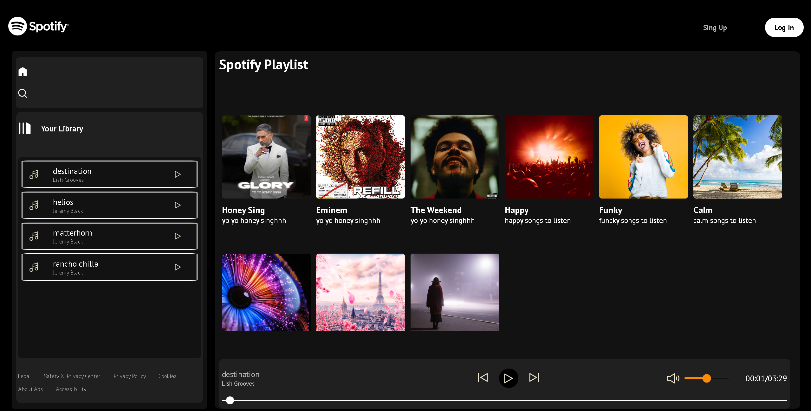
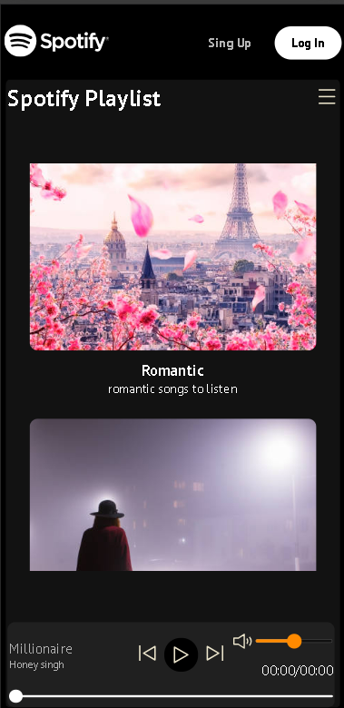

# 🎵 Spotify Clone UI

A responsive and interactive Spotify-inspired music player built with HTML, CSS, and JavaScript.

---

## 🔍 Quick Tour

- Responsive UI with toggleable sidebar (hamburger on mobile)
- Songs and album cards generated from JSON
- Sidebar and playbar display the currently playing song and artist with real-time play/pause status
- Playbar includes controls for Play/pause, next/prev, volume slider, and seek bar

---

## 📷 Screenshots

### 🖥️ Desktop View

### 📱 Mobile View (360px)

---

## 🛠️ Tech Stack

HTML • CSS • JavaScript • JSON

---

## 🚀 Run Locally

Just open `index.html` in your browser — no build tools or server setup needed.

---

## 📁 Folder Overview

- `index.html` – Main entry point  
- `css/` – Stylesheets  
- `js/` – JavaScript logic  
- `images/` – Icons and album art  
- `songs/` – Categorized MP3 files and `info.json` data  

---

## 📌 Tags

#spotify-clone #responsive-ui #html #css #javascript

---

## 📝 License

This project is for demonstration and educational purposes. All branding and assets belong to their respective owners.
